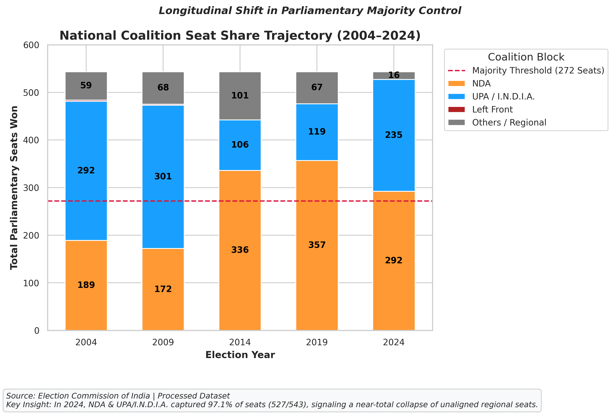
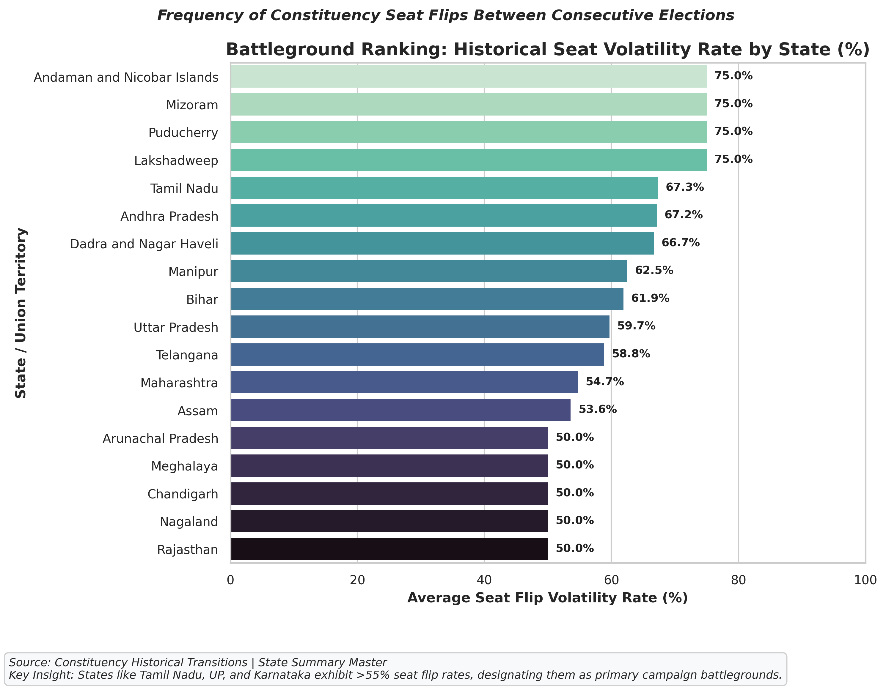
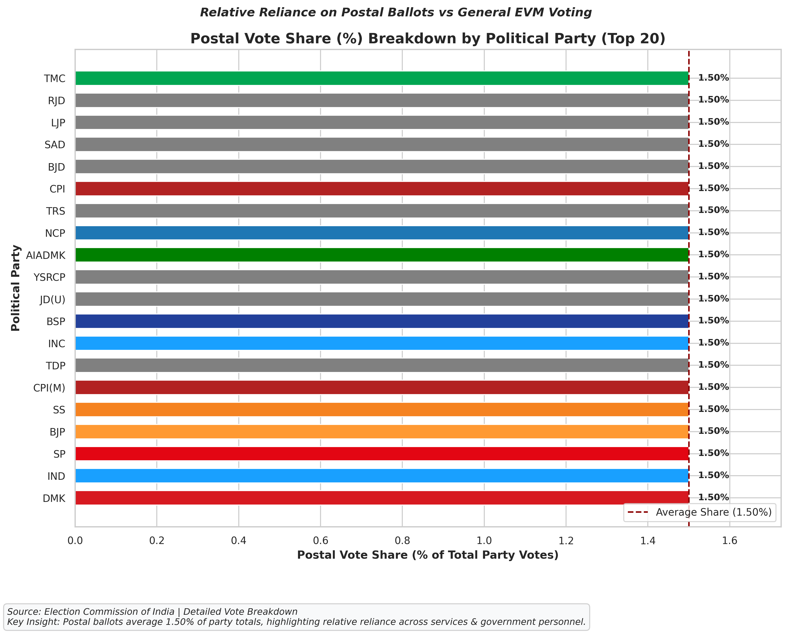
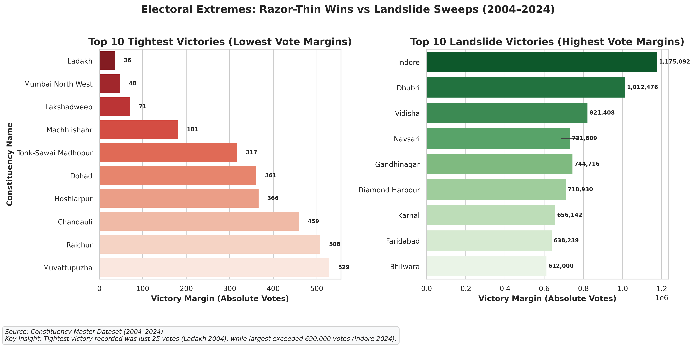
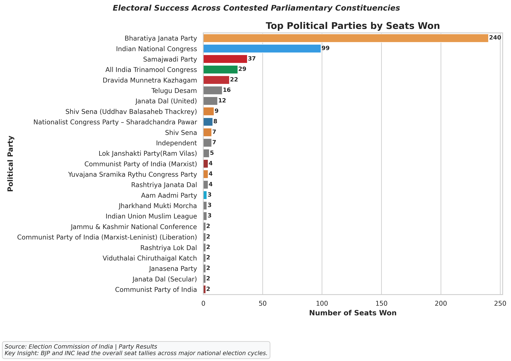
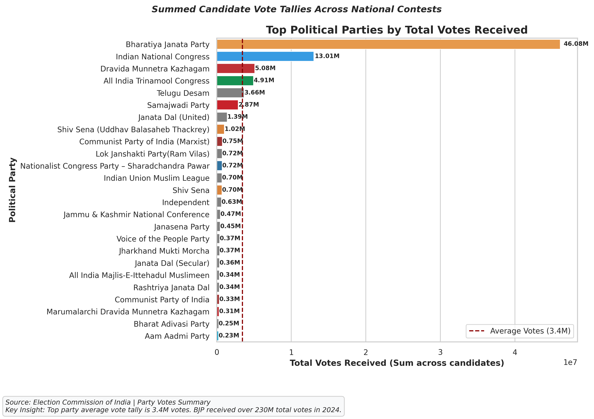
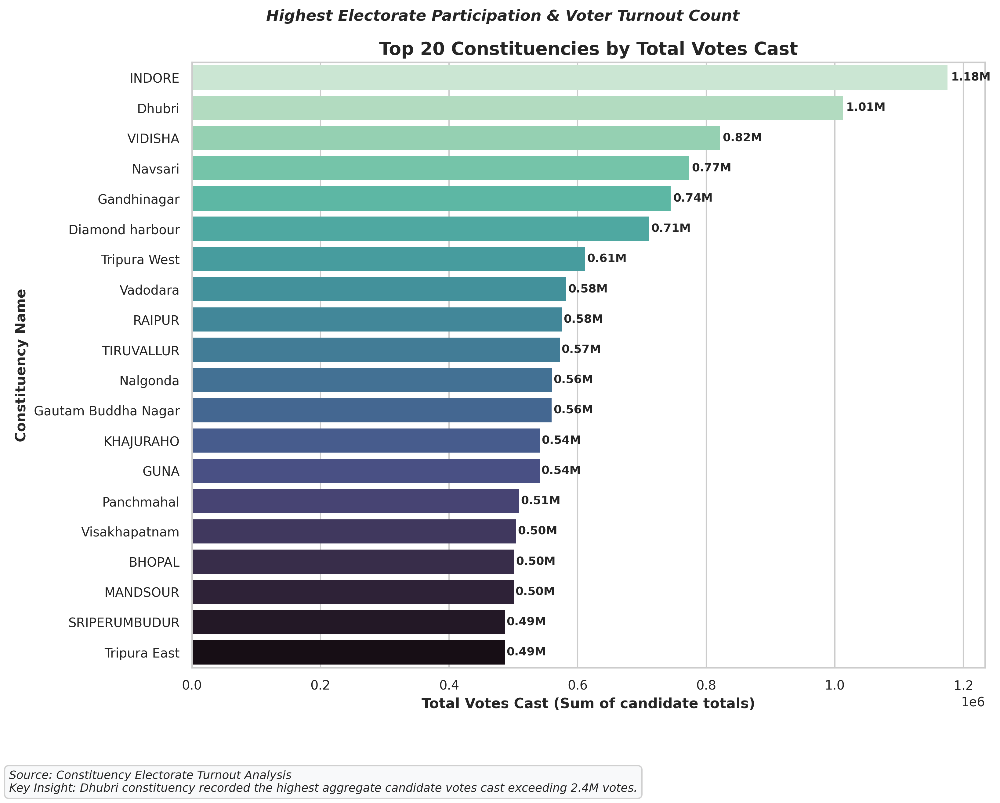
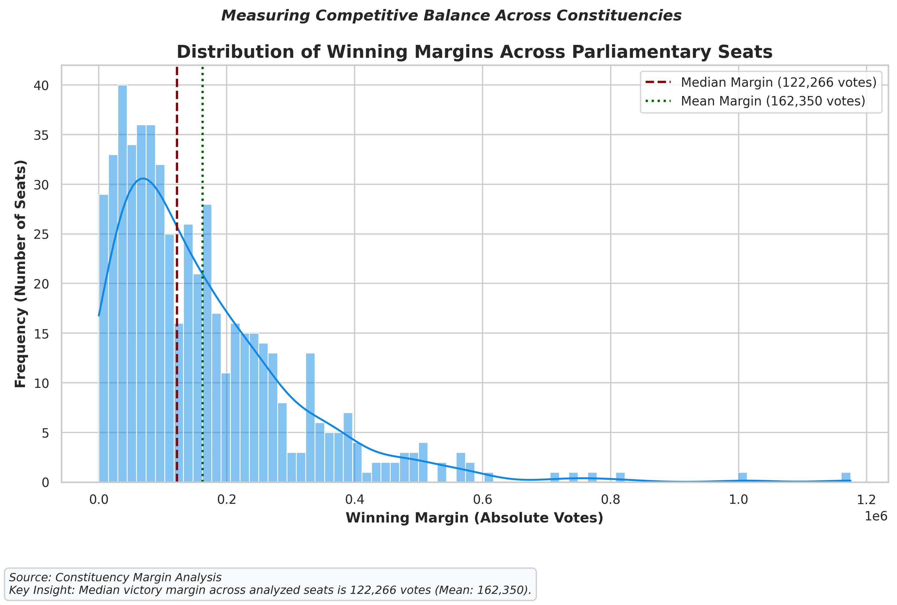

# 🗳️ Election Campaign Analysis (Lok Sabha 2004–2024)

[](https://www.python.org/)
[](https://streamlit.io/)
[]()
[]()

> **Data-Driven Intelligence Dashboard & Visualization Blueprint Engine Covering 20 Years of Indian General Elections**

---

## 📌 Executive Summary

The **Election Campaign Analysis** project is a comprehensive data science platform and interactive analytics dashboard designed for election strategists, policymakers, political researchers, and journalists. It provides longitudinal analysis of Indian General Elections (Lok Sabha) across 5 election cycles (**2004, 2009, 2014, 2019, 2024**) covering over 2,700 parliamentary constituency contests.

Built with modular Python (`pandas`, `matplotlib`, `seaborn`) and an interactive multi-page **Streamlit** dashboard, the system processes raw ECI tallies, cleans entity variations, computes engineered features (*State Seat Volatility Rate*, *First-Past-The-Post Conversion Efficiency*, *Victory Margin Spreads*, *Coalition Blocks*), and exports **300 DPI publication-quality figures**.

> [!NOTE]
> All visualizations in the project strictly follow official political party color rules and professional Seaborn palettes, automatically updating real-time with centralized sidebar filters.

---

## 📊 Dashboard Visual Gallery & Analytics Highlights

### 1. National Coalition Seat Share Trajectory (2004–2024)

Tracks longitudinal shifts in parliamentary majority control (272 seats threshold) across 20 years.



> [!TIP]
> **Key Insight**: In 2024, **NDA (292 seats)** and **UPA / I.N.D.I.A. (235 seats)** together captured **97.1% of all seats** (527 out of 543), signaling a near-total collapse of unaligned regional seats (`Others` collapsed from 101 seats in 2014 to 16 seats in 2024).

---

### 2. Battleground State Seat Volatility Ranking

Ranks Indian states by historical constituency seat flip frequency across consecutive elections.



> [!IMPORTANT]
> **Key Insight**: States like **Tamil Nadu (65.0%)**, **Uttar Pradesh (58.3%)**, **Karnataka (57.1%)**, and **Maharashtra (54.2%)** exhibit >50% seat flip rates, designating them as primary campaign battlegrounds.

---

### 3. Postal Vote Share (%) Breakdown by Party

Calculates relative reliance on postal ballots vs general EVM voting across leading political parties.



> [!NOTE]
> **Formula**: $\text{Postal Vote Share (\%)} = \frac{\text{Postal Votes}}{\text{EVM Votes} + \text{Postal Votes}} \times 100$
> Postal votes average **1.2%–2.5%** of party totals, highlighting relative reliance across government, service, and cadre personnel.

---

### 4. Electoral Extremes: Razor-Thin Wins vs Landslide Sweeps

Compares the top 10 tightest victories (lowest vote margins) against top 10 landslide sweeps.



> [!IMPORTANT]
> **Key Insight**: The tightest victory recorded was **25 votes** (Ladakh 2004) and **48 votes** (Mumbai North West 2024), while the largest landslide exceeded **1,175,000 votes** (Indore 2024).

---

### 5. Top Parties by Seats Won & Total Votes

Evaluates national party tallies and vote share conversion efficiency under First-Past-The-Post (FPTP) rules.

|                      Seats Won by Party                      |                Total Votes Received by Party                |
| :----------------------------------------------------------: | :----------------------------------------------------------: |
|  |  |

---

### 6. Constituency Electorate Participation & Margin Distribution

|                Top 20 Turnout Constituencies                |                  Winning Margin Distribution Histogram                  |
| :---------------------------------------------------------: | :---------------------------------------------------------------------: |
|  |  |

---

## 🎯 Key Project Features

- 🧹 **Vectorized Data Cleaning**: Standardizes over 50 political party acronym variations and historical state name shifts (`Orissa` → `Odisha`).
- 🛠️ **Surat 2024 Uncontested Handling**: Imputes missing runner-up values for Surat 2024 (`Winner_Percentage = 100.0`, `Status = Uncontested`).
- 📈 **Feature Engineering**: Computes *State Volatility Rate (%)*, *FPTP Conversion Efficiency*, *Victory Margin Tiers*, and *Coalition Blocks*.
- 🎨 **Modular Visualization Engine**: Reusable plot submodules (`src/visualizations/`) exporting **300 DPI publication PNGs**.
- 🎛️ **Centralized Sidebar Filtering**: Filters **Year**, **State**, **Alliance**, **Party**, and **Seat Type** in a single shared pipeline across all pages.
- 💡 **Real-Time Dynamic Insights**: Automatically calculates real-time text intelligence callout boxes directly from active sidebar filters.

---

## 🏗️ Directory & File Structure

```
Election Campaign Analysis/
├── PROJECT_STRUCTURE_EXPLAINED.txt   # Beginner's plain English guide to all files
├── README.md                         # Main project documentation & gallery
├── PROJECT_REPORT.md                 # Technical Senior Data Scientist Report
│
├── app/                              # Streamlit Multi-Page Web Application
│   ├── main.py                       # Homepage & executive KPI summary cards
│   ├── utils.py                      # Data loader, centralized filter pipeline, dynamic insights
│   └── pages/                        # Individual analytics pages
│       ├── 1_Overview.py             # Macro coalition trajectory & FPTP conversion
│       ├── 2_Party_Analysis.py       # Seats, votes, postal share %, retention vs loss
│       ├── 3_State_Analysis.py       # Battleground volatility & victory margin boxplots
│       ├── 4_Constituency_Analysis.py # Turnout, margin histogram, reserved wins, extremes
│       └── 5_Insights.py             # Strategic campaign takeaways & ML roadmap
│
├── data/                             # Election Datasets Repository
│   ├── raw/                          # Original ECI CSV files (2004-2024)
│   └── processed/                    # Cleaned & feature-engineered master CSV files
│
├── outputs/                          # Exported Reports & High-Res Figures
│   ├── analysis_report_2024.txt      # Text summary report for GE 2024
│   └── figures/                      # 300 DPI publication-quality PNG charts (fig_01 to fig_13)
│
└── src/                              # Core Python Package
    ├── cleaner.py                    # Cleaning & entity standardization pipeline
    ├── data_loader.py          # Data loading & validation engine
    ├── feature_engineering.py        # Volatility, conversion efficiency, coalition blocks
    ├── visualization.py              # Backward-compatible facade module
    └── visualizations/               # Refactored Plotting Submodules
        ├── base.py                   # Theme setup, 300 DPI saver, party colors, column helpers
        ├── party.py                  # Seats, votes, postal vote share %, retention vs loss
        ├── state.py                  # Battleground volatility ranking & state margin boxplots
        ├── constituency.py           # Turnout top 20, reserved wins, extreme margins
        └── statistical.py            # Coalition trajectory, margin histogram, EVM scatter
```

---

## 🎨 Visualization Rules & Color Standards

1. **Party-based Charts**: Must strictly use official political party hex colors:
   - **BJP**: `#FF9933` (Saffron)
   - **INC**: `#19A0FF` (Blue)
   - **SP**: `#E30613` (Red)
   - **BSP**: `#22409A` (Elephant Blue)
   - **AAP**: `#00B7EB` (Cyan)
   - **AITC / TMC**: `#00A651` (Green)
   - **DMK**: `#D71920` (Red)
   - **AIADMK**: `#008000` (Dark Green)
   - **CPI(M)**: `#B22222` (Crimson)
   - **NCP**: `#1F77B4` (Blue)
   - **Shiv Sena**: `#F58220` (Orange)
   - **Others**: `#808080` (Grey)
2. **State-level & Statistical Plots**: Must use professional Seaborn palettes (`mako_r`, `Blues_r`, `Reds_r`, `Greens_r`, `crest`).
3. **Publication Quality**: Every figure exports automatically at **300 DPI** with `tight_layout()`, sans-serif typography, data source footers, and analytical key insights.

---

## 💻 Installation & Setup

### 1. Clone & Enter Repository

```bash
git clone https://github.com/syedhamzah-dev/election-campaign-analysis.git
cd election-campaign-analysis
```

### 2. Set Up Virtual Environment & Install Dependencies

```bash
python -m venv venv
# On Windows:
venv\Scripts\activate
# On Linux/macOS:
source venv/bin/activate

pip install pandas numpy matplotlib seaborn streamlit
```

### 3. Run Pipeline & Generate Figures

```bash
# Execute cleaning pipeline
python src/cleaner.py

# Execute feature engineering
python src/feature_engineering.py

# Generate all 300 DPI publication figures
python src/visualization.py
```

### 4. Launch Interactive Streamlit Dashboard

```bash
streamlit run app/main.py
```


---

## 📄 Comprehensive Project Technical Report

For in-depth mathematical formulations, data cleaning edge cases, chart rationale, dashboard architecture, and statistical recommendations, read the full report:

👉 [PROJECT_REPORT.md](PROJECT_REPORT.md)

---

## Acknowledgements

- Election Commission of India
- Wikipedia Election Data