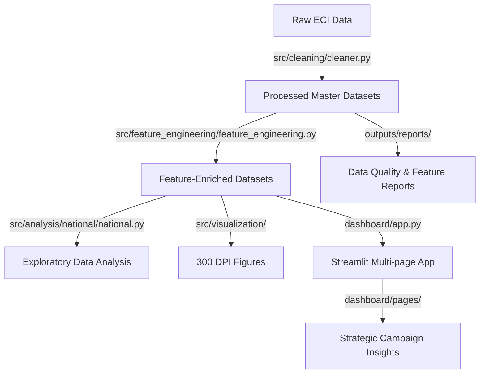
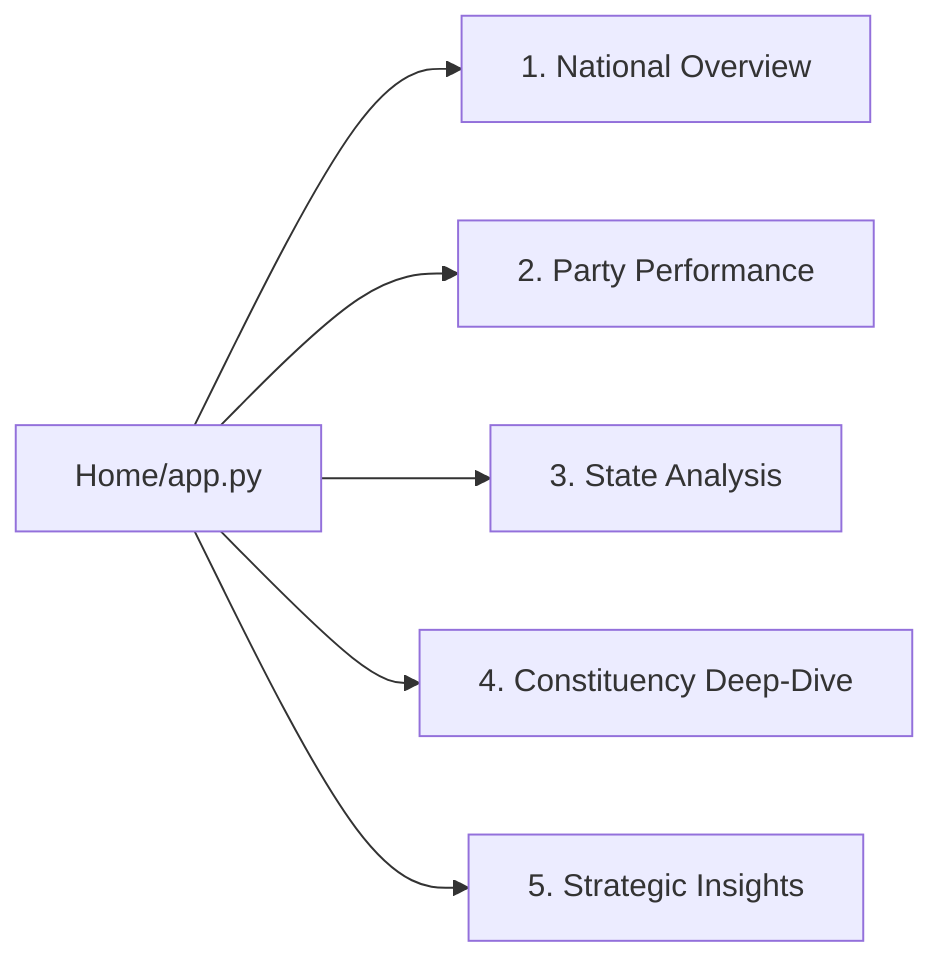

# 🗳️ Election Campaign Analysis (2004–2024)

[](https://www.python.org/)
[](https://pandas.pydata.org/)
[](https://numpy.org/)
[](https://matplotlib.org/)
[](https://seaborn.pydata.org/)
[](https://streamlit.io/)

A modular, production-ready Data Science repository and interactive intelligence dashboard analyzing 20 years of Indian Lok Sabha (General Election) results (2004, 2009, 2014, 2019, 2024).

---

## 📌 Project Overview

The **Election Campaign Analysis** system provides an end-to-end analytical framework and interactive intelligence dashboard covering five consecutive general election cycles (2004–2024).

### The Problem It Solves

Indian Lok Sabha elections represent the largest democratic exercise globally. However, raw data from the Election Commission of India (ECI) exhibits severe inconsistencies:

* **Entity Variation**: Inconsistent party names (e.g., `Bharatiya Janata Party` vs `BJP`, `Shiv Sena (Uddhav Balasaheb Thackrey)` vs `SS(UBT)`) and historical state name changes (e.g., `Orissa` → `Odisha`).
* **Data Gaps**: Missing percentage shares and victory margins in historical records.
* **Scale Disproportions**: Large volumes of EVM votes obscure postal ballot patterns.
* **Static Analytics**: Traditional static reports fail to provide regional or alliance-specific filtering.

This system standardizes, cleans, and enriches these raw datasets, executing a complete data science pipeline to deliver actionable strategic intelligence for campaign managers, researchers, and political analysts.

### Complete Data Science Workflow



---

## ✨ Features

- **Vectorized Data Cleaning**: Standardizes party and state entity variations, handles uncontested seats (e.g., Surat 2024), and dynamically imputes missing vote percentage shares.
- **Electoral Feature Engineering**: Computes margin percentages, competitiveness tiers, consecutive seat flip statuses, incumbent stronghold hold counts, coalition blocks, and vote-to-seat conversion efficiencies.
- **300 DPI Visualization Engine**: Generates 13 publication-quality, themed visualizations with official party/coalition color schemes.
- **Interactive Analytics Dashboard**: A multi-page Streamlit application driven by a centralized sidebar filtering pipeline, displaying dynamic real-time insights based on user selections.
- **Automated Logging & Reporting**: Produces data quality audits, feature engineering reports, and text-based election highlights.

---

## 🏗️ Repository Structure

```text
Election Campaign Analysis/
├── PROJECT_REPORT.md             # Comprehensive data science methodology report
├── TEAM_CONTRIBUTIONS.md         # Contribution guidelines and roles
├── README.md                     # Project overview and instructions
│
├── dashboard/                    # Streamlit Web Application
│   ├── app.py                    # Dashboard landing page with KPIs and workflow
│   ├── pages/                    # Individual dashboard analysis pages
│   │   ├── 1_Overview.py         # National overview & coalition trajectory
│   │   ├── 2_Party_Analysis.py   # Seats, votes, postal reliance, and holds
│   │   ├── 3_State_Analysis.py   # Volatility and victory margin spreads
│   │   ├── 4_Constituency_Analysis.py # Turnout, margin histograms, reserved wins
│   │   └── 5_Insights.py         # Strategic takeaways and ML roadmap
│   └── utils/
│       └── utils.py              # Caching, sidebar filters, & insights engine
│
├── data/                         # CSV Datasets
│   ├── raw/                      # Unmodified ECI source files
│   └── processed/                # Standardized and engineered master files
│
├── docs/                         # Architecture and structure explainers
│   ├── PROJECT_ARCHITECTURE.html  # Interactive visualization map
│   └── PROJECT_STRUCTURE_EXPLAINED.txt # Plain-English codebase explanation
│
├── logs/                         # Execution logs
│   └── cleaning.log              # Run log for data cleaning steps
│
├── outputs/                      # Analytics Outputs
│   ├── figures/                  # 13 high-resolution chart images
│   └── reports/                  # Generated pipeline and analysis reports
│
└── src/                          # Core Python Engine
    ├── cleaning/
    │   └── cleaner.py            # Vectorized cleaning and name standardization
    ├── feature_engineering/
    │   └── feature_engineering.py # Computation of analytical metrics
    ├── analysis/
    │   ├── national/
    │   │   └── national.py       # Coalition seat share trajectory analyzer
    │   └── party/, state/, constituency/, candidate/ # EDA module placeholders
    ├── visualization/            # Modular plotting submodules
    ├── config.py                 # Project path and directory configuration
    └── utils.py                  # Safe data loaders and validation helpers
```

---

## ⚙️ Technology Stack

* **Programming**: Python 3.12+
* **Data Processing**: Pandas, NumPy
* **Visualization Engine**: Matplotlib, Seaborn
* **Web Dashboard**: Streamlit
* **Version Control**: Git & GitHub

---

## 📊 Analysis Modules

The analytical engine processes elections across the following modules (located in `src/analysis/` and visual submodules):

| Module                 | Responsible Script/Source                      | Key Analytics Performed                                                                                  |
| ---------------------- | ---------------------------------------------- | -------------------------------------------------------------------------------------------------------- |
| **National**     | `src/analysis/national/national.py`          | Coalition block trajectories, government formation thresholds, and seat/vote distributions.              |
| **Party**        | `src/visualization/party.py`                 | Seat conversion efficiency, postal ballot reliance, stronghold retention vs loss rates, and total votes. |
| **State**        | `src/visualization/state.py`                 | Regional volatility rates, battleground seat flips, and victory margin spreads by state.                 |
| **Constituency** | `src/visualization/constituency.py`          | Voter turnout volumes, victory distributions, and reservation category (`GEN`/`SC`/`ST`) wins.     |
| **Candidate**    | `dashboard/pages/4_Constituency_Analysis.py` | Searchable Candidate Fact Finder with margins and candidate-specific votes.                              |

---

## 🎨 Visualization Engine

The visualization engine (`src/visualization/`) enforces publication-quality Matplotlib and Seaborn setups (300 DPI, styled titles, and footers). The specialized modules are:

- **`national.py`**: Renders `fig_01_coalition_trajectory.png` (stacked seat trends over time vs the 272 majority benchmark).
- **`party.py`**: Computes and plots party totals (`fig_08_seats_by_party.png`, `fig_09_votes_by_party.png`, `fig_10_postal_vote_share.png`), vote-seat conversion graphs (`fig_02_vote_seat_conversion.png`), and retention/loss charts (`fig_07_party_retention_loss.png`).
- **`state.py`**: Computes state swing metrics and constructs state rankings (`fig_03_state_volatility_ranking.png`) and margin boxplots (`fig_04_state_margin_distribution.png`).
- **`constituency.py`**: Handles constituency metrics (`fig_11_turnout_top20.png`, `fig_05_reserved_category_wins.png`, `fig_06_extreme_margins.png`).
- **`statistical.py`**: Renders winning margin histograms (`fig_12_margins_hist.png`) and EVM vs Postal scatter plots (`fig_13_evm_vs_postal_scatter.png`).

---

## 🖥️ Streamlit Dashboard

The Streamlit application provides a highly polished, interactive UI with five page sections:



### Pages & Navigation

1. **Overview Page (`1_Overview.py`)**: Renders coalition seat trajectory and FPTP vote-seat conversion graphs alongside a national summary table.
2. **Party Analysis Page (`2_Party_Analysis.py`)**: Explores seats won, vote totals, postal vote shares, retention breakdowns, and conversion efficiency.
3. **State Analysis Page (`3_State_Analysis.py`)**: Focuses on swing states, volatility rankings, and margin distributions.
4. **Constituency Analysis Page (`4_Constituency_Analysis.py`)**: Features turnout charts, margin distributions, SC/ST wins, and a searchable candidate fact finder.
5. **Insights Page (`5_Insights.py`)**: Aggregates takeaways, records data limitations, and outlines the ML roadmap.

### Centralized sidebar filters (`dashboard/utils/utils.py`)

- **Year**: Select one or multiple election cycles (2004, 2009, 2014, 2019, 2024).
- **State**: Single dropdown selector to isolate states/UTs.
- **Alliance**: Filters ND, UPA/INDIA, Left Front, or Others.
- **Party**: Multi-select dropdown filtering by specific parties.
- **Seat Type**: Filters by reservation category (All, GEN, SC, ST).

### KPIs & Live Callouts

The homepage and subpages calculate real-time summary statistics:

- **Elections Analyzed** (number of cycles, range)
- **Total Constituencies** & contests
- **Covered States/UTs** (100% pan-India coverage)
- **Average Winning Margin**
- **Filter Intelligence Box**: Dynamic textual callout summarizing top parties, alliances, margins, and battlegrounds under the current selection.

---

## 📋 Reports

The pipeline auto-generates reports in `outputs/reports/`:

- **`data_quality_report.md`**: Tracks dataset shapes, duplicate counts, and validates clean datasets.
- **`feature_engineering_report.md`**: Provides exact mathematical formulas and feature distributions.
- **`analysis_report_2024.txt`**: Records top parties, tightest margins, and peak turnout seats for the 2024 cycle.

---

## 📂 Outputs Reference

- **`outputs/figures/`**: Consists of 13 high-resolution chart images (`fig_01` to `fig_13`) tracking coalition trajectory, FPTP conversion, state volatility, margin distributions, reserved wins, closest contests, and EVM/Postal distributions.
- **`outputs/reports/`**: Master data reports, quality audits, and analysis texts.

---

## 🚀 Installation

1. Clone this repository:

   ```bash
   git clone https://github.com/your-username/election-campaign-analysis.git
   cd election-campaign-analysis
   ```
2. Install the required dependencies:

   ```bash
   pip install pandas numpy matplotlib seaborn streamlit
   ```

---

## ▶ Running the Dashboard

Launch the interactive dashboard locally:

```bash
streamlit run dashboard/app.py
```

To regenerate all 13 high-resolution publication charts:

```bash
python src/visualization/__init__.py
```

---

## 🔮 Future Scope

- **Machine Learning**: Implementing decision trees and logistic regression classifiers to predict constituency seat flip probability.
- **Spatial Mapping**: Integrating geopandas and folium for interactive GIS choropleth constituency maps.
- **Deployment**: Deploying the dashboard to a cloud provider (e.g., Streamlit Community Cloud or Heroku).


---

## 🤝 Acknowledgements

- **Election Commission of India (ECI)**: For compiling and publishing historical Lok Sabha results.
- **Wikipedia** : For giving trusted data.
- **Streamlit & Python Open-Source Communities**: For visualization and web framework support.
